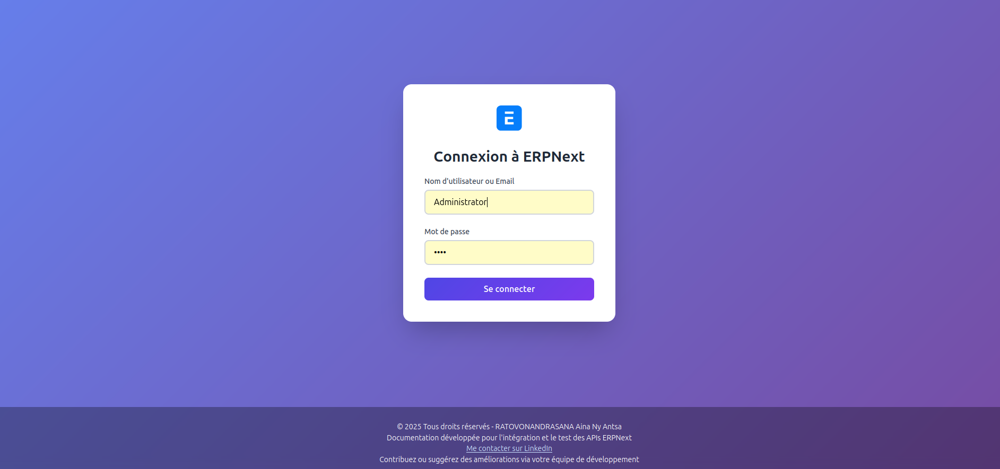
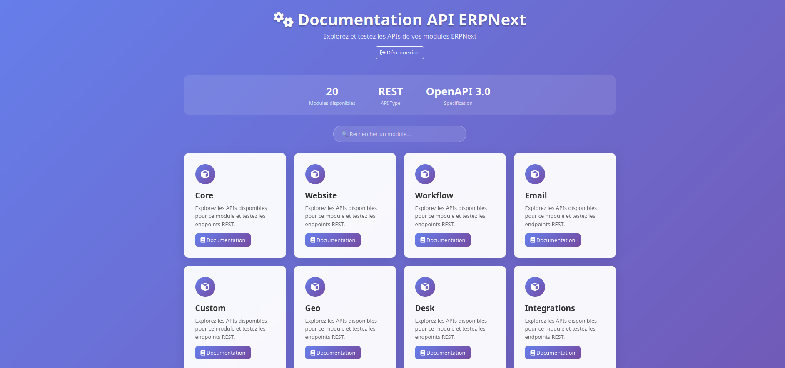
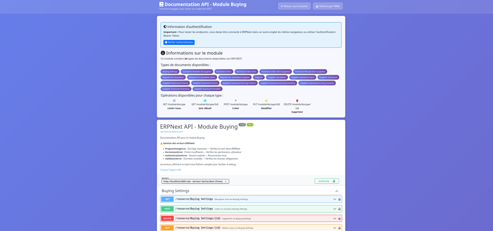
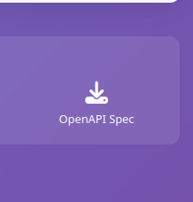
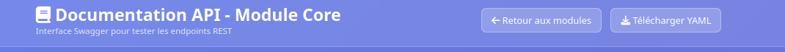

# 📚 Documentation API ERPNext via Swagger


Une application Spring Boot qui génère automatiquement une documentation Swagger interactive pour toutes les APIs ERPNext, permettant de tester facilement tous les endpoints REST des modules ERPNext.

## 🎯 Fonctionnalités

- ✅ **Authentification sécurisée** avec ERPNext via session/cookies
- 🔍 **Découverte automatique** de tous les modules et DocTypes ERPNext
- 📖 **Documentation Swagger interactive** générée dynamiquement
- 🧪 **Test en temps réel** de tous les endpoints API
- 📥 **Export YAML/JSON** des spécifications OpenAPI
- 🎨 **Interface utilisateur moderne** avec design responsive
- 🔄 **Proxy intelligent** pour contourner les problèmes CORS
- 📊 **Support complet CRUD** (Create, Read, Update, Delete)

## 🛠️ Technologies utilisées

- **Backend** : Spring Boot 3.x, Spring Web, Spring Security
- **Documentation** : Swagger UI, OpenAPI 3.0
- **Frontend** : Thymeleaf, Bootstrap 5, Font Awesome
- **HTTP Client** : RestTemplate pour les appels ERPNext
- **Format** : JSON/YAML pour les spécifications API

## 📋 Prérequis

- ☕ **Java 17** ou supérieur
- 🐘 **Maven 3.6+** ou Gradle
- 🌐 **Instance ERPNext** accessible (locale ou distante)
- 🔐 **Compte utilisateur ERPNext** avec permissions API

## ⚙️ Installation et Configuration

### 1. Cloner le projet

```bash
git clone https://github.com/antsamadagascar/Documentation-Api-Swagger.git
cd Documentation-Api-Swagger
```

### 2. Configuration ERPNext

Créez ou modifiez le fichier `src/main/resources/application.properties` :

```properties
# Configuration ERPNext
frappe.url=http://votre-instance-erpnext.com
# ou pour une instance locale
# frappe.url=http://localhost:8000

# Configuration serveur
server.port=8080

# Configuration session
server.servlet.session.timeout=30m
server.servlet.session.cookie.max-age=1800

# Configuration logs (optionnel)
logging.level.com.example.demo=DEBUG
logging.level.org.springframework.web=INFO
```

### 3. Compilation et démarrage

```bash
# Avec Maven
mvn clean install
mvn spring-boot:run

# Avec Gradle
./gradlew clean build
./gradlew bootRun
```

L'application sera accessible sur : `http://localhost:8080`

## 🚀 Guide d'utilisation

### Étape 1: Connexion à ERPNext



1. Accédez à `http://localhost:8080/login`
2. Saisissez vos identifiants ERPNext :
   - **Nom d'utilisateur** : votre email ERPNext
   - **Mot de passe** : votre mot de passe ERPNext
3. Cliquez sur **Se connecter**

### Étape 2: Exploration des modules



Après connexion, vous verrez :
- 📂 **Liste de tous les modules** ERPNext disponibles
- 📊 **Statistiques** des DocTypes par module
- 🔍 **Recherche et filtrage** des modules

### Étape 3: Documentation Swagger d'un module



1. Cliquez sur un module (ex: "Selling", "Buying", "HR")
2. L'interface Swagger s'ouvre avec :
   - 📋 **Liste des DocTypes** du module
   - 🔧 **Endpoints disponibles** pour chaque DocType
   - 📝 **Schémas de données** automatiquement générés

### Étape 4: Test des endpoints API


Pour chaque DocType, vous pouvez tester :

#### 📖 **GET** - Lister les documents
```
GET /api/resource/{doctype}
```
- Récupère tous les documents d'un type
- Support des filtres JSON optionnels

#### 👁️ **GET** - Voir un document spécifique
```
GET /api/resource/{doctype}/{id}
```
- Récupère un document par son ID

#### ➕ **POST** - Créer un document
```
POST /api/resource/{doctype}
```
- Crée un nouveau document
- Body JSON avec les données

#### ✏️ **PUT** - Modifier un document
```
PUT /api/resource/{doctype}/{id}
```
- Met à jour un document existant

#### 🗑️ **DELETE** - Supprimer un document
```
DELETE /api/resource/{doctype}/{id}
```
- Supprime un document

### Étape 5: Télécharger les spécifications
### 📥 Téléchargement du fichier YAML

#### 1. **Fichier complet – depuis l'interface Swagger**

  
*Exemple : bouton "Download YAML" dans Swagger UI pour **tous les modules** regroupés*

#### 2. **Fichier spécifique – via une URL dédiée**

  
*Exemple : accès direct au fichier YAML pour un **module spécifique***

👉 URL directe (à adapter selon le module) :  
`http://localhost:8080/api/openapi/{module}.yaml`

2. **Pour tous les modules** :
   - Accédez à `http://localhost:8080/api/openapi.yaml`
   - Ou en JSON : `http://localhost:8080/api/openapi.json`

### Étape 6: Test sur un site externe


1. **Avec Postman** :
   - Importez le fichier YAML téléchargé
   - Configurez l'authentification Bearer Token ou Cookies

2. **Avec Swagger Editor** :
   - Allez sur [editor.swagger.io](https://editor.swagger.io)
   - Importez votre fichier YAML
   - Testez directement depuis l'éditeur

3. **Avec curl** :
```bash
# Exemple avec authentification
curl -X GET "http://localhost:8080/api/resource/Customer" \
  -H "Authorization: Bearer YOUR_TOKEN" \
  -H "Content-Type: application/json"
```

## 🔐 Gestion de l'authentification

### Méthodes d'authentification supportées

1. **Session Cookies** (recommandé pour les tests via navigateur)
   - Authentification automatique après login
   - Session partagée avec ERPNext

2. **Bearer Token** (pour les appels API externes)
   - Générez un token API dans ERPNext
   - Ajoutez `Authorization: Bearer YOUR_TOKEN` dans les headers

### Vérification de l'authentification

Utilisez l'endpoint de vérification :
```
GET /api/auth/check
```

## 📁 Structure du projet

```
src/
├── main/
│   ├── java/com/example/demo/
│   │   ├── controller/
│   │   │   ├── AuthController.java          # Gestion authentification
│   │   │   ├── WebController.java           # Pages web Thymeleaf
│   │   │   ├── ErpNextProxyController.java  # Proxy API ERPNext
│   │   │   └── OpenApiController.java       # Génération Swagger
│   │   ├── service/
│   │   │   ├── AuthService.java             # Service authentification
│   │   │   ├── ErpNextClientService.java    # Client ERPNext
│   │   │   └── OpenApiBuilderService.java   # Générateur OpenAPI
│   │   └── DemoApplication.java             # Application principale
│   └── resources/
│       ├── templates/                       # Templates Thymeleaf
│       │   ├── pages/auth/
│       │   └── pages/documentation/
│       ├── static/                          # CSS, JS, images
│       └── application.properties           # Configuration
```

## 🐛 Dépannage

### Problèmes courants

#### ❌ Erreur "Non authentifié"
- Vérifiez vos identifiants ERPNext
- Assurez-vous que l'URL ERPNext est correcte
- Vérifiez que votre utilisateur a les permissions API

#### ❌ Erreur CORS
- L'application utilise un proxy Spring Boot
- Pas besoin de configuration CORS supplémentaire

#### ❌ Erreur "Module non trouvé"
- Vérifiez que le module existe dans votre instance ERPNext
- Certains modules peuvent être désactivés

#### ❌ Timeout de session
- Ajustez `server.servlet.session.timeout` dans application.properties
- Reconnectez-vous si nécessaire

### Logs de débogage

Activez les logs détaillés :
```properties
logging.level.com.example.demo=DEBUG
logging.level.org.springframework.web.client=DEBUG
```

### Endpoints de diagnostic

- `GET /api/auth/check` - Vérifier l'authentification
- `GET /api/auth/user` - Informations utilisateur connecté

## 🤝 Contribution

Les contributions sont les bienvenues ! Pour contribuer :

1. **Fork** le projet
2. Créez une **branche feature** (`git checkout -b feature/amelioration`)
3. **Committez** vos changements (`git commit -m 'Ajout d'une fonctionnalité'`)
4. **Push** vers la branche (`git push origin feature/amelioration`)
5. Ouvrez une **Pull Request**

### Conventions de code

- Suivez les conventions Java standard
- Documentez les nouvelles fonctionnalités
- Ajoutez des tests unitaires si possible
- Respectez l'architecture existante

## 📜 Licence

Ce projet est sous licence MIT. Voir le fichier [LICENSE](LICENSE.md) pour plus de détails.

## 👨‍💻 Auteur

**RATOVONANDRASANA Aina Ny Antsa**
- 💼 LinkedIn : [aina-ny-antsa-ratovonandrasana](https://www.linkedin.com/in/aina-ny-antsa-ratovonandrasana)
- 📧 Email : antsamdagascar@gmail.com

## 🙏 Remerciements

- L'équipe **ERPNext/Frappe** pour leur excellente API REST
- La communauté **Spring Boot** pour le framework
- **Swagger UI** pour l'interface de documentation

---

*Documentation développée pour simplifier l'intégration et le test des APIs ERPNext*

**⭐ N'hésitez pas à mettre une étoile si ce projet vous aide !**